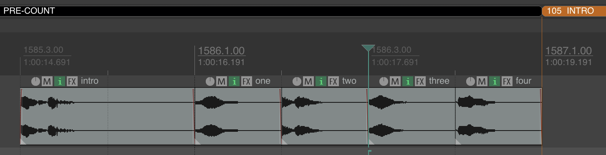

# REAPER Counter Guide Script 🎚️⏱️

Uno script Lua per REAPER che genera automaticamente una traccia di guida con conteggi vocali e annunci di sezione, perfetto per sessioni di registrazione dal vivo, produzione musicale e post-produzione audio.

 
*(Sostituisci con un'immagine reale del tuo script in azione)*

## 🌟 Funzionalità principali

- **Creazione automatica** della traccia "COUNTER GUIDE" (o riutilizzo se esiste)
- **Analisi intelligente** delle regioni nella time selection
- **Sistema di conteggio avanzato**:
  - Annuncio della prossima sezione al 4° battito prima della fine
  - Conteggio "two, three, four" nei 3 battiti successivi
- **Pre-count speciale** (6 battiti) quando la prossima sezione è "Intro"
- **Pulizia automatica** degli item esistenti nella time selection
- **Console di debug** con informazioni dettagliate sull'esecuzione

## 🛠️ Requisiti tecnici

- REAPER versione 6.x o 7.x
- Permessi di scrittura nella cartella degli script di REAPER
- File audio dei conteggi in formato WAV (16/24-bit, 44.1/48kHz consigliati)

## 📥 Installazione passo-passo

1. **Scarica lo script**:
   - [Clicca qui per scaricare counter_guide.lua](https://example.com/download) *(sostituisci con link reale)*
   - Oppure copia il codice sorgente in un file con estensione `.lua`

2. **Posiziona lo script**:
    - Windows: C:\Users[Tuonome]\AppData\Roaming\REAPER\Scripts
    - MacOS: ~/Library/Application Support/REAPER/Scripts/
    - Linux: ~/.config/REAPER/Scripts/
    
3. **Crea la struttura delle cartelle**:
    - Apri il terminale ed esegui questo comando:
` mkdir -p "REAPER/Scripts/Cockos/Counter_Script/" `

    - Importa la cartella CounterSample

 ## ⌨️ Assegnazione Scorciatoia (Opzionale)

Per assegnare una scorciatoia da tastiera:

1. Apri REAPER
2. Vai su `Actions > Show Action List`
3. Cerca "Counter Guide"
4. Clicca su "Add" per assegnare un tasto di scelta rapida

## 🎛️ Utilizzo Base

1. **Prepara il progetto**:
   - Organizza con regioni (**N.B. non marker**) nominate (es. "VERSE", "CHORUS", "BRIDGE") 
  >I nomi delle regioni devono essere scritti in maiuscolo e senza nomi

2. **Seleziona intervallo**:
   - Evidenzia l'area temporale che copre le regioni interessate

3. **Esegui lo script**:
   - Dal menu: `Actions > Scripts > Counter Guide`
   - Oppure usa la scorciatoia assegnata

4. **Risultato**:
   - Nuova traccia "COUNTER GUIDE" con:
     - Annunci delle sezioni
     - Conteggi ritmici pre-transizione

## 🐛 Troubleshooting

| Problema                  | Soluzione                      |
|---------------------------|--------------------------------|
| "File non trovato"        | Verifica percorso e nomi file  |
| Conteggi non allineati    | Controlla il BPM del progetto  |
| Errori Lua                | Aggiorna REAPER all'ultima versione |
| Traccia non creata        | Controlla i permessi di scrittura |

## 🤝 Contributi

I contributi sono benvenuti! Ecco come aiutare:

1. **Forka** il repository
2. **Crea un branch**:  
   `git checkout -b feature/improvement`
3. **Fai commit** delle modifiche:  
   `git commit -am 'Aggiungi nuova funzionalità'`
4. **Pusha** il branch:  
   `git push origin feature/improvement`
5. **Crea una Pull Request**

## 📜 Licenza

**MIT License** - Usa, modifica e distribuisci liberamente
